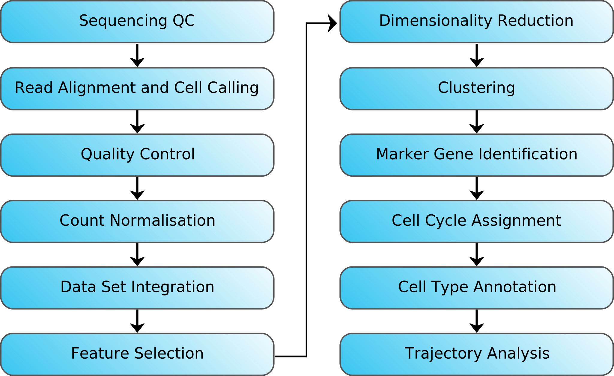
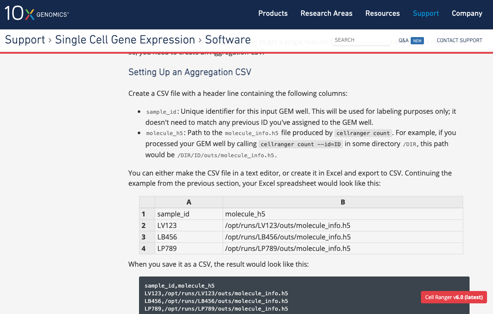
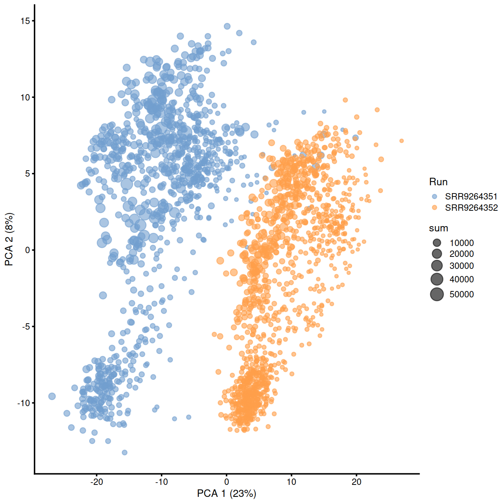
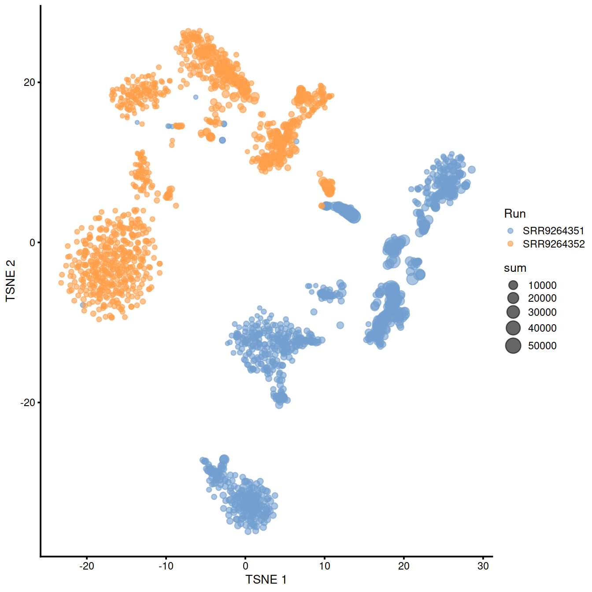
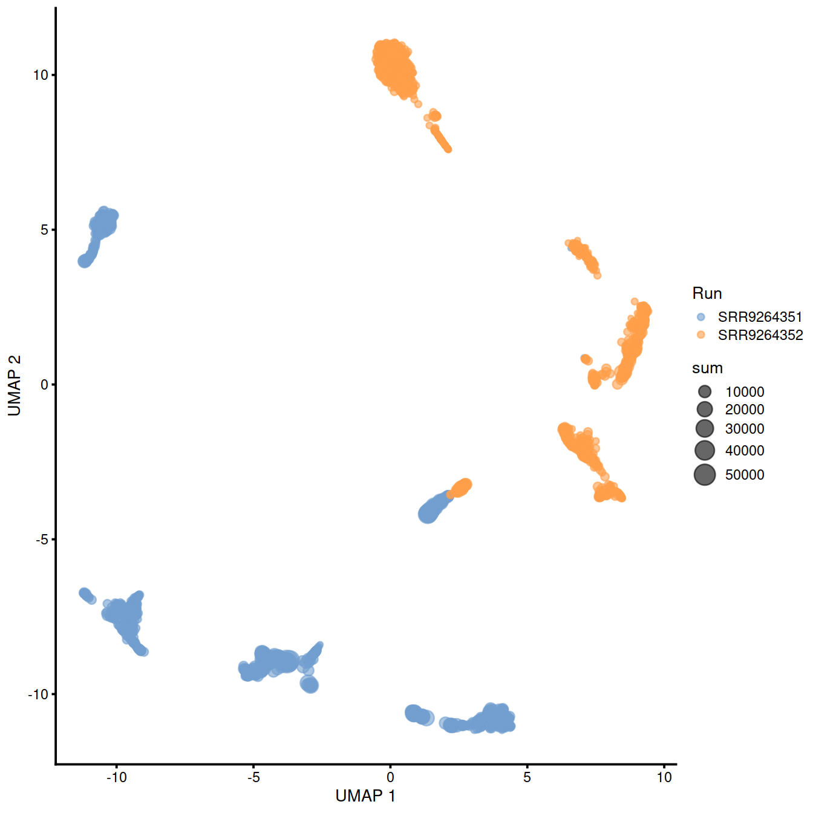

```{r include=FALSE}
library(tidyr)
library(dplyr)

```

## Workflow



## Why do we need to think about data intergration?

- Practicalities of our Experimental Design

- Different 10X runs at different times OR just the same sample run twice

- Obscure real biological changes

## Formatting our data

A few ways our data can be arranged (software dependent too)

- single sample SCE objects QCed in isolation

- large SCE object containing many samples

- multiple large SCE objects with multiple samples


Important we make sure things match up

- Different bioconductor versions

- Different analysts may have formatted things differently


## Cellranger aggr

A useful quick look



## Checking for batch effects





## Batch Corrections

- Gaussian/Linear Regression - removeBatchEffect (limma), comBat (sva), rescaleBatches or regressBatches (batchelor)

- Mutual nearest neighbour correction - Haghverdi et al 2018 Nature Biotechnology

  - mnnCorrect (batchelor)
  
  - FastMNN (batchelor)

- Harmony - Korsunsky et al, 2019 Nature Methods

## FastMNN

1. Perform a multi-sample PCA on the (cosine-)normalized expression values to reduce dimensionality.
2. Identify MNN pairs in the low-dimensional space between a reference batch and a target batch.
3. Remove variation along the average batch vector in both reference and target batches.
4. Correct the cells in the target batch towards the reference, using locally weighted correction vectors.
5. Merge the corrected target batch with the reference, and repeat with the next target batch.

## Checking our correction has worked


## Checking our correction hasn't over worked

## Using the corrected values


